

# [K. M. Shawkat Zamil](#)

<a href="https://www.linkedin.com/in/k-m-shawkat-zamil-379a97234/"
class="linkedin" target="_blank"><em></em></a>
<a href="https://github.com/KMSZamil" class="github"
target="_blank"><em></em></a>
<a href="mailto:email@echoecho.com" class="google-plus"
target="_blank"><em></em></a>
<a href="https://join.skype.com/invite/yAEx56SM7IVx" class="google-plus"
target="_blank"><em></em></a>
<a href="https://www.facebook.com/kazishawkat.zamil/" class="facebook"
target="_blank"><em></em></a>
<a href="https://www.instagram.com/kazi_shawkat_zamil/"
class="instagram" target="_blank"><em></em></a>

- <a href="#hero" class="nav-link scrollto active"><em></em>
  Home</a>
- <a href="#about" class="nav-link scrollto"><em></em>
  About</a>
- <a href="#profession" class="nav-link scrollto"><em></em>
  Professional Experience</a>
- <a href="#education" class="nav-link scrollto"><em></em>
  Education</a>
- <a href="#portfolio" class="nav-link scrollto"><em></em>
  Portfolio</a>
- <a href="#services" class="nav-link scrollto"><em></em>
  Services</a>

# K. M. Shawkat Zamil

I'm 

Download CV

## About

I am K. M. Shawkat Zamil, a proficient full-stack engineer with a wealth
of experience spanning over five years in the industry with a strong
background in PHP programming language, ReactJs, Laravel, CodeIgniter
and expertise in both MySQL and MSSQL Server databases. My expertise
extends across the entire software development lifecycle, from
conceptualization and design to implementation and deployment. I have a
proven track record of delivering robust and scalable solutions that
cater to diverse business requirements.

### Senior Software Engineer

I am well-versed in collaborating effectively with cross-functional
teams and thrive in dynamic work environments. My commitment to
excellence, coupled with a proactive approach to problem-solving,
enables me to consistently exceed client expectations and deliver
exceptional results. My proficiency in PHP and Laravel allows me to
architect robust and scalable web applications, while my skills in
ReactJs and VueJs enhance user interfaces with dynamic and responsive
features.

-  **Email:** kmszamil@gmail.com
-  **Birthday:** 17 Oct 1994
-  **Website:** kmszamil.github.io

-  **Phone:** +880 192 735 7213
-  **City:** Dhaka, Bangladesh

In addition to my technical expertise, I bring valuable leadership
experience to the table. I have successfully served as a team lead,
overseeing and coordinating project teams to achieve project goals
efficiently and within established timelines. My ability to communicate
effectively with both technical and non-technical stakeholders has
played a crucial role in project success.

## Skills

Laravel *90%*

CodeIgniter *85%*

JavaScript *75%*

React *70%*

PHP *80%*

MySql *90%*

MSSQL *80%*

Git *90%*

## Professional Experience

#### Senior Software Engineer

*BRAC Aarong, Bangladesh*

##### March 2024 - Present

- Lead and oversee the eCommerce Technology team comprised of developers
  from Ranosys and Unicommerce India, as well as Site Admins and Site
  Merchandisers from Aarong.
- Coordinate, manage, and provide guidance to team leads and developers
  to ensure the development of solutions aligns with requirements and
  adheres to industry standards.
- Responsible for managing all aspects of e-commerce Solutions,
  including Desktop, Responsive, and Native Apps. This entails
  overseeing Site configuration, Administration (SWAT and Regular Health
  Check), Merchandising, Fastly CDN Management, ACL, Role resources,
  Cache, Index, and Job Management, Configuration.

#### Senior Software Engineer

*ACI Limited*

##### July 2022 - March 2024

- Orchestrated the dissemination of crucial information to team members
  and stakeholders.
- Directed project management efforts by articulating objectives,
  contextualizing work, and navigating problem-solving scenarios.
- Proficiently composed and executed efficient code.
- Fostered close collaboration with fellow developers, UX designers, and
  business/systems analysts.
- Performed code reviews, estimations, and actively sought out learning
  opportunities to adopt new techniques and develop reusable, easily
  understandable code. analysts.

#### Software Engineer

*ACI Limited*

##### August 2021 - June 2022

- Developed web applications using a variety of engineering languages.
- Collaborated with cross-functional teams to define features and build
  powerful and easy-to-use products and customer-facing workflow tools.
- Identify areas for improvement in existing programs and execute
  necessary modifications.
- Develop and implement quality assurance procedures to maintain high
  standards of software quality.

#### Information Technology Analyst

*ACI Limited*

##### April 2019 - July 2021

- Adapted new technology and methods, enhancing program effectiveness.
- Identified opportunities for innovating with digital capabilities,
  accelerating digital transformation.
- Prepared and presented technical proposals for clients.

#### Intern

*Samsung R&D Institute Bangladesh*

##### August 2018 - November 2018

- Attended and actively participated in meetings and brainstorming
  sessions with team members.
- Conducted software testing, meticulously wrote test cases, and
  prepared comprehensive reports for the team lead.

## Education

#### Executive Masters of Business Administration (EMBA)

##### 2023 - Present

*University of Dhaka, Dhaka, Bangladesh*

Major: Management Information Systems (MIS)

#### B.Sc. in Engineering

##### 2013 - 2016

*Rajshahi University of Engineering & Technology, Rajshahi, Bangladesh*

Major: Computer Science and

Result: CGPA 3.60 (Out of 4)

#### Higher Secondary School Certificate (HSC)

##### 2011 - 2012

*National Ideal College, Dhaka, Bangladesh*

Major: Science

Result: GPA 5.00 (Out of 5)

#### Secondary School Certificate (SSC)

##### 2002 - 2010

*Motijheel Govt. Boys' High School, Dhaka, Bangladesh*

Major: Science

Result: GPA 5.00 (Out of 5)

## Portfolio

With my extensive web development background, I possess comprehensive
knowledge and hands-on experience in web app development, having crafted
over 200 applications using frameworks like Laravel, CodeIgniter,
NextJs, and Flutter.

- All
- Web
- App
- Design

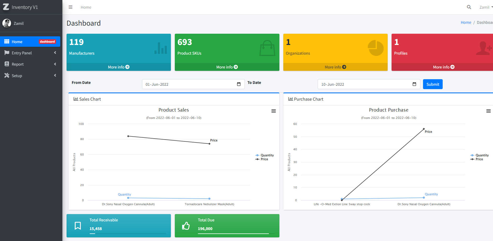

<a href="assets/img/portfolio/portfolio-1-web.jpg"
class="portfolio-lightbox" data-gallery="portfolioGallery"
title="Web 1"><em></em></a> 

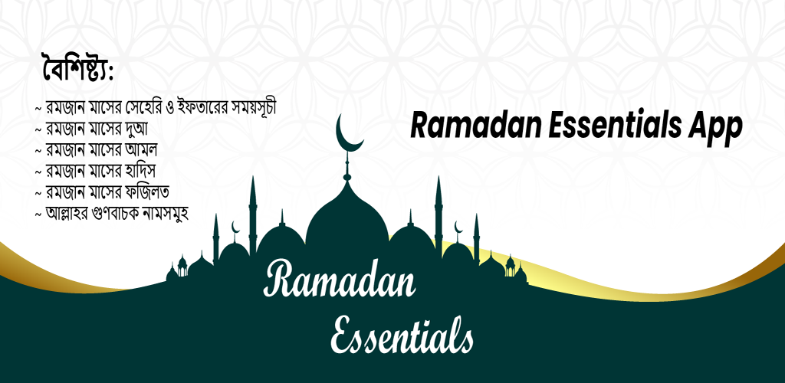

<a href="assets/img/portfolio/portfolio-1-app.jpg"
class="portfolio-lightbox" data-gallery="portfolioGallery"
title="App 1"><em></em></a> <a
href="https://play.google.com/store/apps/details?id=com.fzrtechnology.ramadan_essentials&amp;hl=en&amp;gl=US"
target="_blank" title="More Details"><em></em></a>

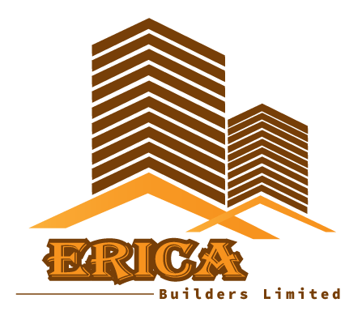

<a href="assets/img/portfolio/portfolio-1-card.jpg"
class="portfolio-lightbox" data-gallery="portfolioGallery"
title="Card 1"><em></em></a> 

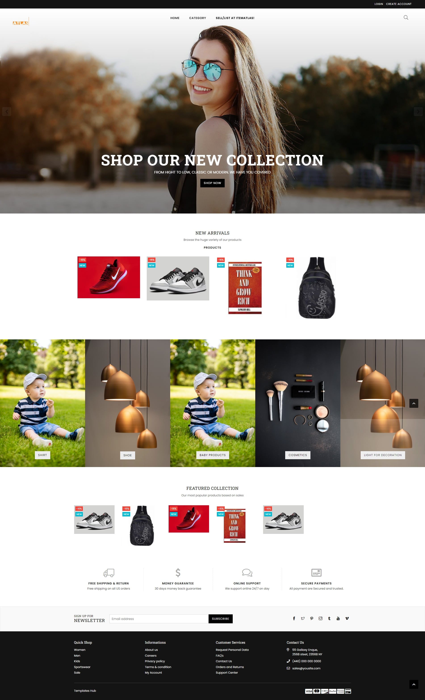

<a href="assets/img/portfolio/portfolio-2-web.jpg"
class="portfolio-lightbox" data-gallery="portfolioGallery"
title="Web 2"><em></em></a> 

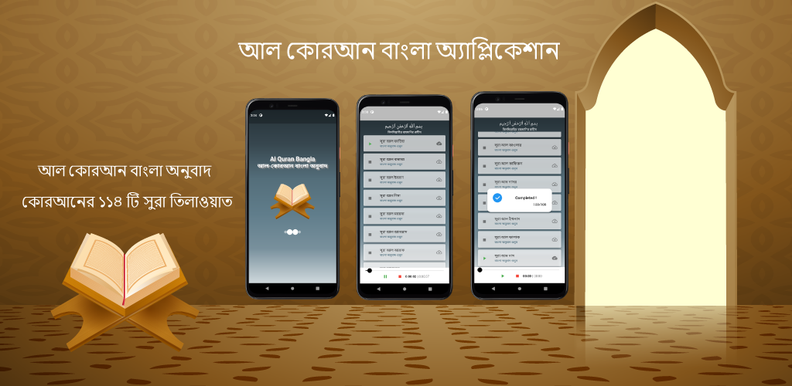

<a href="assets/img/portfolio/portfolio-2-app.jpg"
class="portfolio-lightbox" data-gallery="portfolioGallery"
title="App 2"><em></em></a> <a
href="https://play.google.com/store/apps/details?id=com.fzrtechnology.al_quran_bangla_translation&amp;hl=en&amp;gl=US"
target="_blank" title="More Details"><em></em></a>

<a href="assets/img/portfolio/portfolio-2-card.jpg"
class="portfolio-lightbox" data-gallery="portfolioGallery"
title="Card 2"><em></em></a> 

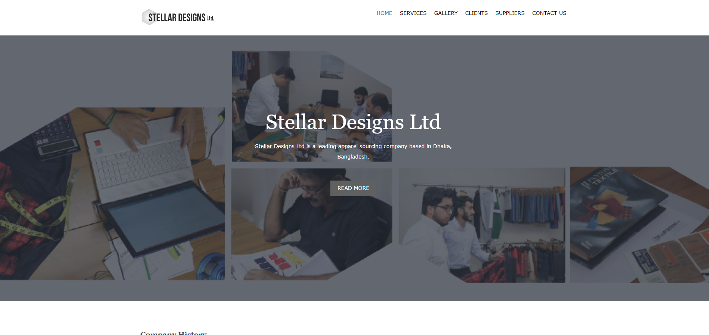

<a href="assets/img/portfolio/portfolio-3-web.jpg"
class="portfolio-lightbox" data-gallery="portfolioGallery"
title="Web 3"><em></em></a>
<a href="https://github.com/KMSZamil/own-StellerDesignLimited-web.git"
target="_blank" title="More Details"><em></em></a>

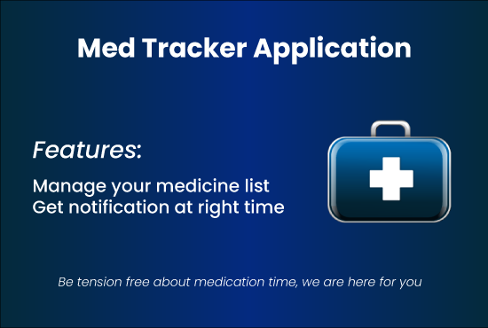

<a href="assets/img/portfolio/portfolio-3-app.jpg"
class="portfolio-lightbox" data-gallery="portfolioGallery"
title="App 3"><em></em></a> <a
href="https://play.google.com/store/apps/details?id=com.fzrtechnology.medtracker&amp;hl=en&amp;gl=US"
target="_blank" title="More Details"><em></em></a>

<a href="assets/img/portfolio/portfolio-3-card.jpg"
class="portfolio-lightbox" data-gallery="portfolioGallery"
title="Card 3"><em></em></a> 

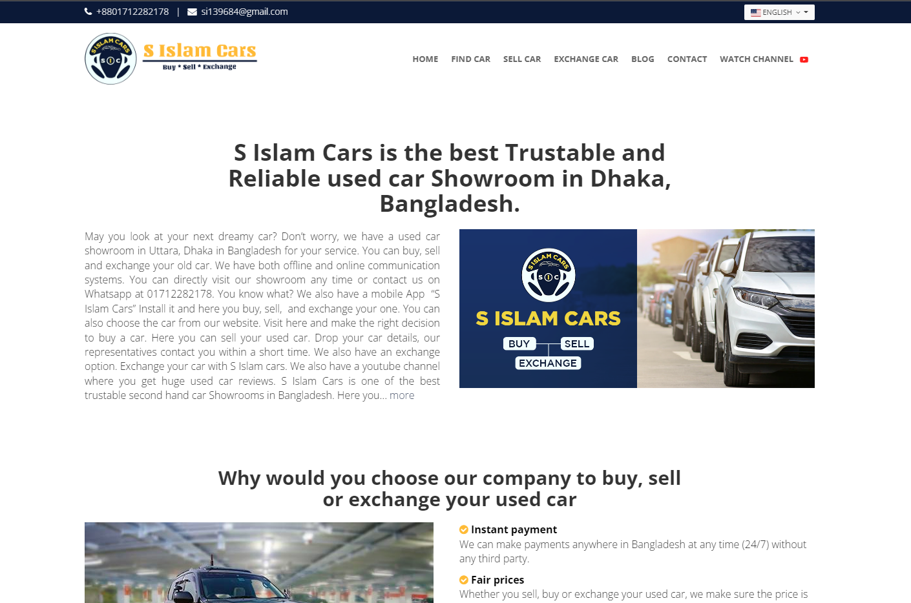

<a href="assets/img/portfolio/portfolio-4-web.jpg"
class="portfolio-lightbox" data-gallery="portfolioGallery"
title="Web 4"><em></em></a>
<a href="https://github.com/KMSZamil/web-sislam-new.git" target="_blank"
title="More Details"><em></em></a>

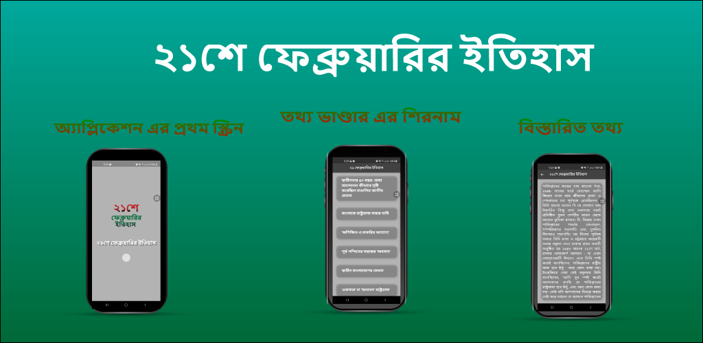

<a href="assets/img/portfolio/portfolio-4-app.jpg"
class="portfolio-lightbox" data-gallery="portfolioGallery"
title="App 4"><em></em></a> <a
href="https://play.google.com/store/apps/details?id=com.fzrtechnology.ekushe_february&amp;hl=en&amp;gl=US"
target="_blank" title="More Details"><em></em></a>

<a href="assets/img/portfolio/portfolio-4-card.jpg"
class="portfolio-lightbox" data-gallery="portfolioGallery"
title="Card 4"><em></em></a> 

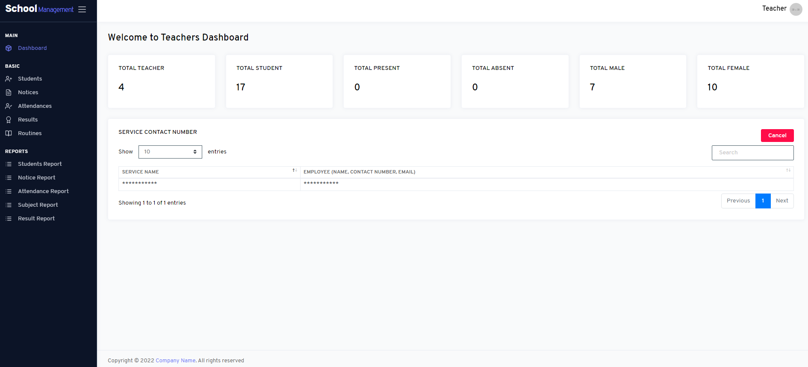

<a href="assets/img/portfolio/portfolio-5-web.jpg"
class="portfolio-lightbox" data-gallery="portfolioGallery"
title="Web 5"><em></em></a>
<a href="https://github.com/KMSZamil/aci-SoftwareInventory.git"
target="_blank" title="More Details"><em></em></a>

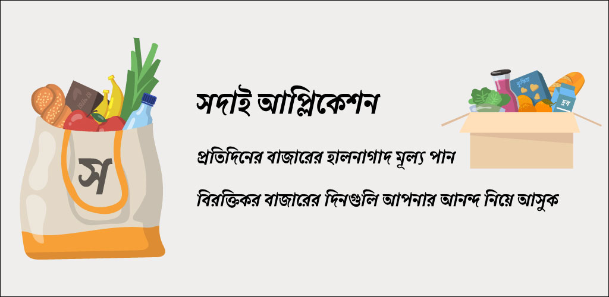

<a href="assets/img/portfolio/portfolio-5-app.jpg"
class="portfolio-lightbox" data-gallery="portfolioGallery"
title="App 5"><em></em></a> 

<a href="assets/img/portfolio/portfolio-5-card.jpg"
class="portfolio-lightbox" data-gallery="portfolioGallery"
title="Card 5"><em></em></a> <a
href="https://play.google.com/store/apps/details?id=com.fzrtechnology.online_bangla_radio&amp;hl=en&amp;gl=US"
target="_blank" title="More Details"><em></em></a>

<a href="assets/img/portfolio/portfolio-6-web.jpg"
class="portfolio-lightbox" data-gallery="portfolioGallery"
title="Web 6"><em></em></a> 

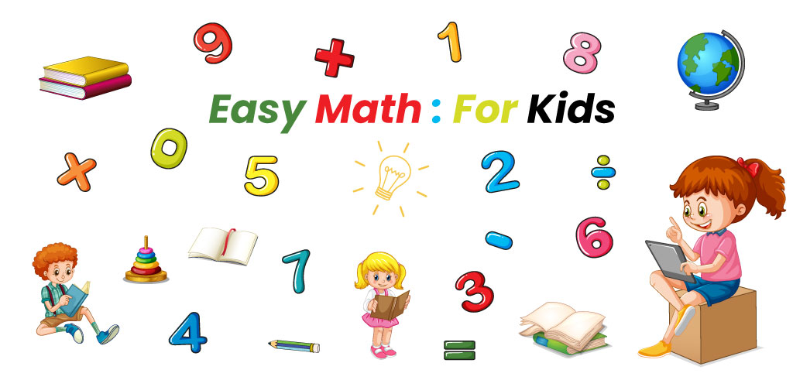

<a href="assets/img/portfolio/portfolio-6-app.jpg"
class="portfolio-lightbox" data-gallery="portfolioGallery"
title="App 6"><em></em></a> <a
href="https://play.google.com/store/apps/details?id=com.fzrtechnology.easy_math_for_kids&amp;hl=en&amp;gl=US"
target="_blank" title="More Details"><em></em></a>

<a href="assets/img/portfolio/portfolio-7-app.jpg"
class="portfolio-lightbox" data-gallery="portfolioGallery"
title="App 7"><em></em></a> <a
href="https://play.google.com/store/apps/details?id=com.fzrtechnology.online_bangla_radio&amp;hl=en&amp;gl=US"
target="_blank" title="More Details"><em></em></a>

<a href="assets/img/portfolio/portfolio-6-card.jpg"
class="portfolio-lightbox" data-gallery="portfolioGallery"
title="Card 6"><em></em></a> 

<a href="assets/img/portfolio/portfolio-7-web.jpg"
class="portfolio-lightbox" data-gallery="portfolioGallery"
title="Web 7"><em></em></a> 

<a href="assets/img/portfolio/portfolio-7-card.jpg"
class="portfolio-lightbox" data-gallery="portfolioGallery"
title="Card 7"><em></em></a> <a
href="https://play.google.com/store/apps/details?id=com.fzrtechnology.easy_math_for_kids&amp;hl=en&amp;gl=US"
target="_blank" title="More Details"><em></em></a>

<a href="assets/img/portfolio/portfolio-8-web.jpg"
class="portfolio-lightbox" data-gallery="portfolioGallery"
title="Web 8"><em></em></a> 

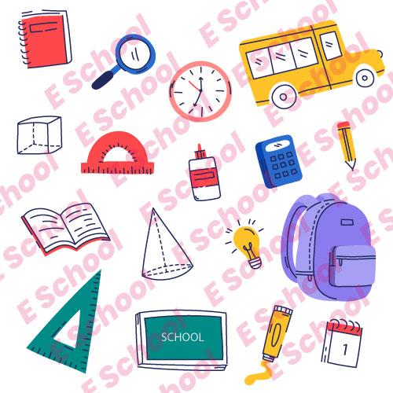

<a href="assets/img/portfolio/portfolio-8-card.jpg"
class="portfolio-lightbox" data-gallery="portfolioGallery"
title="Card 8"><em></em></a> 

<a href="assets/img/portfolio/portfolio-9-web.jpg"
class="portfolio-lightbox" data-gallery="portfolioGallery"
title="Web 9"><em></em></a> 

<a href="assets/img/portfolio/portfolio-10-web.jpg"
class="portfolio-lightbox" data-gallery="portfolioGallery"
title="Web 10"><em></em></a> 

<a href="assets/img/portfolio/portfolio-11-web.jpg"
class="portfolio-lightbox" data-gallery="portfolioGallery"
title="Web 11"><em></em></a> 

<a href="assets/img/portfolio/portfolio-12-web.jpg"
class="portfolio-lightbox" data-gallery="portfolioGallery"
title="Web 12"><em></em></a> 

<a href="assets/img/portfolio/portfolio-13-web.jpg"
class="portfolio-lightbox" data-gallery="portfolioGallery"
title="Web 13"><em></em></a> 

## Facts

I possess a proven track record of successfully delivering numerous web
projects, resulting in a portfolio of satisfied clients. Through
meticulous attention to detail, effective communication, and a
commitment to excellence, I consistently meet and exceed client
expectations, ensuring their happiness and fostering lasting
relationships built on trust and quality service.

**Projects**

**Happy Clients**

**Hours Of Support**

**Partners**

## Services

As a seasoned professional in website and mobile app development, I
specialize in delivering tailored solutions for individuals and
companies alike. With a keen understanding of market dynamics and
technological trends, I excel in crafting bespoke roadmaps to empower
entrepreneurs in launching their ventures.

#### [Website Developmet]()

I specialize in crafting websites tailored to address my clients' unique
business challenges. In the contemporary landscape, a website serves as
the fundamental introduction to any business. This understanding drives
my commitment to developing various types of websites, including
portfolio websites, inventory management websites, e-commerce platforms,
and more.

#### [Mobile Application Development]()

Citing my proficiency in Flutter, I've successfully developed numerous
mobile applications. I specialize in delivering tailor-made mobile
applications, ranging from e-commerce platforms to news aggregators,
portfolio showcases, and beyond. Whatever the client's vision, I
transform it into a polished, functional reality.

#### [Frontend Development]()

I specialize in crafting bespoke IT solutions finely tuned to meet the
unique requirements and obstacles faced by every client. From dynamic
e-commerce interfaces to engaging news aggregators and captivating
portfolio displays, I guarantee that the solutions I deliver seamlessly
address each client's frontend development needs. My focus remains on
ensuring that the provided solutions not only resolve client challenges
but also elevate their online presence and user experience to new
heights

#### [Backend Development]()

Specializing in backend development using Laravel, MySQL, and MSSQL, I
deliver robust and efficient solutions tailored to meet your specific
requirements. With Laravel's elegant syntax and powerful features,
coupled with the reliability of MySQL and MSSQL databases, I ensure
seamless data management and optimal performance for your applications.
Let me handle the backend complexities while you focus on scaling your
business and achieving your goals.

#### [Server Maintenance]()

Regular server maintenance is crucial for optimal performance and
reliability. From applying security patches to optimizing
configurations, our dedicated team meticulously tends to every aspect of
your server infrastructure. By proactively identifying and addressing
potential issues, we minimize downtime, safeguard data integrity, and
uphold seamless operations. Trust us to keep your servers running
smoothly, allowing you to focus on your core business without
interruption.

#### [Timeliness]()

My leaders guide us through the process by outlining subtasks,
establishing milestones, defining dependencies, calculating cost
estimations, and more right from the outset.

## Contact

#### Location:

Dhaka, Bangladesh

#### Email:

kmszamil@gmail.com

#### Call:

+880 192 735 7213

© Copyright 2024All Right reserved

Developed by [K. M. Shawkat Zamil](https://kmszamil.github.io/)

<a href="#"
class="back-to-top d-flex align-items-center justify-content-center"><em></em></a>
